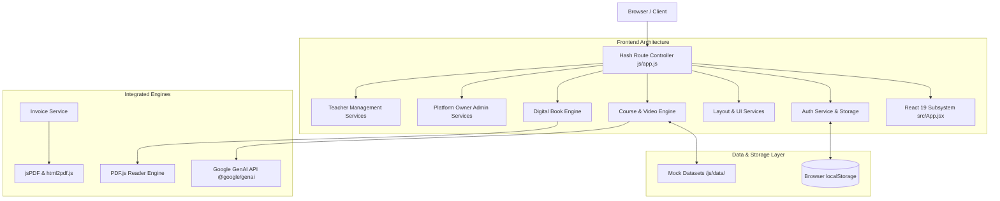

<div align="center">

# 🎓 StudyMart — Modern E-Learning & Digital Publishing Platform

**An Arabic-First, High-Performance Single Page Application for Online Courses, Digital Books, & Platform Administration**

[](https://github.com/eslam-adel25)
[](https://react.dev)
[](https://vitejs.dev)
[](https://tailwindcss.com)
[](https://github.com/eslam-adel25)

</div>

---

## 👨‍💻 About the Developer

> **Eslam Adel (إسلام عادل)**
> 
> **Role & Background**: Computer Science Student & Frontend Software Engineer focused on building modern, high-performance web applications, intuitive user interfaces, and robust client architectures.
> 
> 🌐 **GitHub**: [eslam-adel25](https://github.com/eslam-adel25)  
> ✉️ **Contact**: `eslam.adel2596@gmail.com`   
> 📞 **Phone**: `+20 1153054568`

---

## 📖 About StudyMart

**StudyMart** is a full-featured, offline-first E-Learning & Digital Books marketplace engineered specifically for Arabic-speaking educators and students. Built with React 19, Vite, Tailwind CSS, and modular ES JavaScript, StudyMart combines video course streaming, interactive PDF book reading, quiz assessment, teacher revenue management, and platform administrative governance into a single, cohesive web application.

---

## 🚀 Key Highlights & Architectural Strengths

- 👑 **Role-Based Access Control (RBAC)**: Enforces distinct capabilities across 4 roles (**Platform Owner**, **Teacher**, **Student**, **Guest**) with automatic paid content bypass for Platform Owner auditing.
- 📐 **RTL-First Arabic Experience**: Engineered natively in Arabic (`dir="rtl"`) with Tajawal display typography, responsive drawer sidebars, and custom dark/light theme switching.
- 📚 **Digital PDF Book Reader**: Embedded client-side PDF viewer powered by `PDF.js` with page navigation, zoom, bookmarks, and configurable free preview page limits.
- 🎬 **Interactive Learning Portal**: Course video streaming player, section/lesson breakdown, progress checkmarks, downloadable resources, and auto-generated completion certificates.
- 🤖 **AI-Powered Question Bank**: Question creation engine with Google Gemini AI integration (`@google/genai`) for automated quiz question generation.
- 🧾 **E-Commerce & Printable Receipts**: Shopping cart, promo codes, simulated payment gateways (Credit Card, Vodafone Cash, InstaPay), and PDF receipt invoice generation (`jsPDF` / `html2pdf.js`).
- 🛡️ **Account Governance & Suspension**: Real-time student blocking and teacher suspension engine with custom support contact modals.

---

## 📐 System Architecture



---

## 🔐 Role & Permission Overview

| Role | Primary Dashboard Route | Core Administrative Capabilities |
|---|---|---|
| **Platform Owner** 👑 | `#owner/homepage-management` | Homepage feature editor, student accounts & blocking, teacher accounts & suspension, payout approvals, platform 10% revenue view, bypass paid content restrictions. |
| **Teacher / Instructor** 👨‍🏫 | `#teacher/dashboard` | Course Builder, Digital Book Builder, owned content management, Question Bank & Gemini AI, student gradebook, wallet & payout requests, sales analytics. |
| **Enrolled Student** 🎓 | `#my-courses` / `#my-books` | Course enrollment, video player, PDF book reader, wishlist, cart & checkout, purchase history & PDF receipts, course completion certificates. |
| **Public Visitor / Guest** 🌐 | `#home` / `#courses` | Public landing page, course catalog, book catalog, instructor public profiles, dedicated public review feed (`#public-reviews`). |

---

## 📁 Repository Structure

```
studymart/
├── css/                        # Global & component stylesheet rules
├── data/                       # Initial JSON/JS mock datasets (courses, books, users)
├── js/                         # Modular ES JavaScript core
│   ├── components/             # Reusable vanilla JS UI renderers
│   ├── pages/                  # Page layout modules
│   ├── services/               # Domain business logic & services
│   │   ├── accountStatusService.js   # Account blocking & suspension engine
│   │   ├── authService.js            # Auth modal, login/register, Google OAuth
│   │   ├── courseBuilderService.js   # Course creation wizard
│   │   ├── homepageManagementService.js # Owner homepage editor
│   │   ├── ownerStudentsService.js   # Owner student management
│   │   ├── ownerTeachersService.js   # Owner teacher management
│   │   ├── permissionService.js      # Central RBAC permission checks
│   │   ├── sidebarService.js         # Responsive navigation sidebar
│   │   └── ...                       # Additional domain services
│   ├── utils/                  # Helper utilities (alerts, formatters)
│   └── app.js                  # Main SPA hash router & initialization
├── src/                        # React 19 Subsystem
│   ├── components/             # React dashboard sidebars & course cards
│   ├── App.jsx                 # Secondary React router entry
│   └── main.jsx                # React DOM mount point
├── docs/                       # Comprehensive System Documentation
│   ├── architecture.md         # Detailed system architecture
│   ├── features.md             # Complete feature inventory
│   ├── roles-and-permissions.md# RBAC permissions matrix
│   ├── routing.md              # Hash routing map
│   ├── authentication.md       # Auth & account status lifecycle
│   ├── data-model.md           # Data schemas & localStorage keys
│   ├── ui-ux.md                # Design system & RTL rules
│   ├── localization.md         # Arabic i18n & formatting
│   ├── setup.md                # Installation & run guide
│   ├── security.md             # Security analysis & guidelines
│   ├── limitations.md          # Project scope & boundaries
│   └── changelog.md            # Release history
├── index.html                  # Main SPA HTML entry point
├── package.json                # Project dependencies & scripts
└── vite.config.js              # Vite build configuration
```

---

## 🛠️ Technology Stack

| Component | Library / Tool | Version | Purpose |
|---|---|---|---|
| **Core UI Engine** | React | `^19.0.1` | Component UI subsystem |
| **Bundler & Server** | Vite | `^6.2.3` | Hot Module Replacement & build bundler |
| **Styling** | Tailwind CSS | `^4.1.14` | Utility-first CSS styling via `@tailwindcss/vite` |
| **Icons** | Lucide React | `^0.546.0` | Vector UI icons |
| **AI Question Gen** | Google GenAI | `^2.4.0` | Gemini AI quiz generation |
| **PDF Reader** | PDF.js | `3.11.174` | Canvas digital book reader |
| **PDF Invoices** | jsPDF / html2pdf | `^4.2.1` / `^0.14.0` | Printable receipt invoice generator |

---

## ⚡ Quick Start & Installation

### 1. Clone & Install
```bash
git clone https://github.com/eslam-adel25/studymart.git
cd studymart
npm install
```

### 2. Configure Environment Variables
```bash
cp .env.example .env
```

### 3. Run Local Development Server
```bash
npm run dev
```
Open `http://localhost:3000` in your web browser.

### 4. Build for Production
```bash
npm run build
npm start
```

---

## 📚 Deep Documentation (`docs/`)

Explore the dedicated documentation files inside the [`docs/`](./docs) directory for in-depth technical references:

- 🏛️ **[System Architecture](./docs/architecture.md)** — Architectural design, layers, and component state flow.
- 👑 **[Roles & Permission Matrix](./docs/roles-and-permissions.md)** — Complete RBAC capabilities table.
- 📋 **[Feature Inventory](./docs/features.md)** — Comprehensive list of all features by role.
- 🗺️ **[Routing & Route Map](./docs/routing.md)** — Hash route map and guard protections.
- 🔑 **[Authentication & Account Lifecycle](./docs/authentication.md)** — Session management, OAuth, and suspension modals.
- 🗄️ **[Data Models & Schemas](./docs/data-model.md)** — Entity schemas and `localStorage` keys reference.
- 🎨 **[UI/UX & Design System](./docs/ui-ux.md)** — RTL design principles, Tajawal typography, and color tokens.
- 🌍 **[Localization & i18n](./docs/localization.md)** — Arabic terminology and formatting.
- 💻 **[Installation & Setup Guide](./docs/setup.md)** — Local setup, environment setup, and CLI scripts.
- 🛡️ **[Security Architecture](./docs/security.md)** — Protection measures and security guidelines.
- ⚠️ **[Known Limitations](./docs/limitations.md)** — Scope boundaries and environment requirements.
- 📜 **[Changelog & Release Notes](./docs/changelog.md)** — Version release history.

---

## 👤 Author & Contact

**Eslam Adel** — Frontend Software Developer & CS Student
- **GitHub**: [@eslam-adel25](https://github.com/eslam-adel25)
- **Email**: `eslam.adel2596@gmail.com` | `2005eaja@gmail.com`
- **Phone**: `+20 1153054568`
