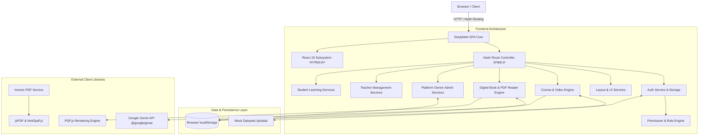
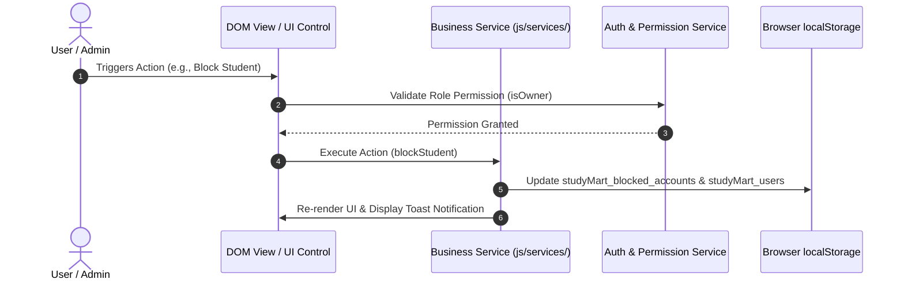

# StudyMart — System Architecture

This document provides a detailed breakdown of the system architecture, component design, state flow, and technology infrastructure powering **StudyMart**.

---

## 1. High-Level Architectural Overview

StudyMart is structured as a **Single Page Application (SPA)** built with modular JavaScript (ES Modules) and React components, served via Vite. The application operates completely client-side, using `localStorage` for state persistence and dynamic ES module imports for performance optimization.

---

## 2. Layered Software Architecture

The codebase follows a clean separation of concerns across distinct modular layers:

### Layer 1: Application Entry & Routing (`/js/app.js` & `/src/main.jsx`)
- **Global Event Loop**: Listens to `hashchange` and `popstate` events.
- **Route Guard Protection**: Evaluates user authentication and role permissions before rendering protected views.
- **Service Initialization**: Bootstraps navigation history, sidebar managers, layout engines, and authentication state on application launch.

### Layer 2: Presentation & UI Services (`/js/services/` & `/js/components/`)
- **Layout Services (`layoutService.js`, `sidebarService.js`, `themeService.js`)**: Manages dynamic DOM manipulation, drawer overlays, theme switching (dark/light), and active route highlighting.
- **Domain Services**:
  - `homepageManagementService.js`: Platform Owner home configuration.
  - `ownerStudentsService.js` & `ownerTeachersService.js`: Account management and suspension tools.
  - `courseBuilderService.js` & `bookBuilderService.js`: Interactive content creation wizards.
  - `advancedQuizService.js` & `advancedAssignmentService.js`: Interactive assessment and grading engines.
  - `messageCenterService.js`: Student-Teacher-Owner messaging center.
  - `payoutsService.js` & `revenueTransactionService.js`: Revenue sharing, financial ledger, and payout workflow.

### Layer 3: Data & State Layer (`/js/data/` & `/js/services/authStorage.js`)
- **Static Initial Data**: Datasets for courses, books, reviews, students, teachers, transactions, and questions.
- **Reactive Global State (`window.appState`)**: In-memory state holding current cart items, logged-in user profile, enrolled courses, and active filters.
- **Local Storage Manager**: Handles persistence for sessions (`studyMart_user_session`), custom user accounts (`studyMart_users`), cart (`studyMart_cart`), favorites (`studyMart_favorites`), and account suspensions (`studyMart_blocked_accounts`).

---

## 3. Technology Stack & Dependencies

The technology stack is extracted directly from the verified project manifest (`package.json`):

| Layer | Technology | Version | Purpose |
|---|---|---|---|
| **Core Framework** | React | `^19.0.1` | Component UI rendering subsystem |
| **DOM Engine** | React DOM | `^19.0.1` | React rendering integration |
| **Routing** | React Router DOM | `^7.18.2` | Secondary React route mapping |
| **Build Tool & Server** | Vite | `^6.2.3` | Bundler, dev server, and HMR engine |
| **Styling Framework** | Tailwind CSS | `^4.1.14` | Utility-first CSS engine via `@tailwindcss/vite` |
| **Icons** | Lucide React | `^0.546.0` | Vector icon suite |
| **Animations** | Motion | `^12.23.24` | Smooth visual transitions |
| **AI Integration** | Google GenAI SDK | `^2.4.0` | Gemini AI question auto-generation |
| **Document Generation** | jsPDF & html2pdf.js | `^4.2.1` / `^0.14.0` | Client-side receipt and invoice PDF generation |
| **PDF Rendering** | PDF.js | `3.11.174` | Canvas-based PDF digital book reader |
| **Barcode / QR** | QRCode | `^1.5.4` | QR code generation for course/book receipts |
| **Local Server** | Express | `^4.21.2` | Server entry point for static serving |

---

## 4. Design & Component Architecture

StudyMart adopts a hybrid design architecture:
1. **Plain ES Module Components (`/js/components/`)**: Lightweight, high-performance vanilla JS modules that dynamically render content into predefined DOM containers (e.g. `courseCard.js`, `books.js`, `teachers.js`, `modal.js`).
2. **React Subsystem (`/src/components/`)**: Modern React functional components utilizing Tailwind utility classes for high-density dashboard layouts (`CoursesPage.jsx`, `CourseDetailsPage.jsx`, `TeacherSidebar.jsx`, `StudentSidebar.jsx`).

---

## 5. Persistence & Data Flow Architecture

Because StudyMart is built as an offline-first, client-enforced application, all user actions (course purchases, book creations, profile updates, account suspensions, payout requests) update `window.appState` and sync immediately to `localStorage`.

