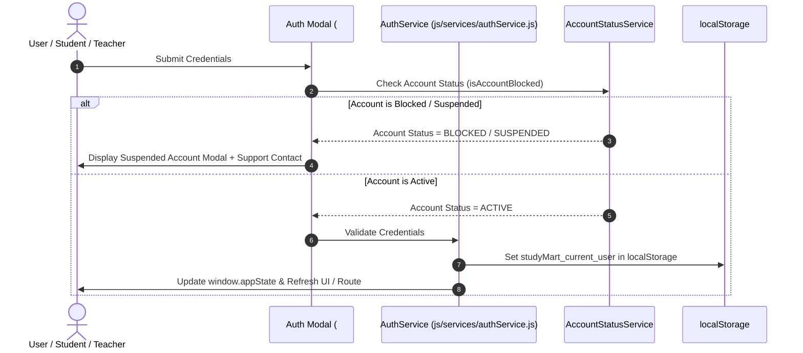

# StudyMart — Authentication & Account Lifecycle Architecture

This document details the authentication subsystem, session management, Google OAuth integration, and account suspension/blocking lifecycle across StudyMart.

---

## 1. Authentication Architecture Overview

StudyMart provides a client-enforced authentication system with zero external server dependencies, powered by `/js/services/authService.js` and `/js/services/authStorage.js`.

---

## 2. Authentication Flows & Methods

### 1. Traditional Email & Password Login
- **Flow**:
  1. User opens Auth Modal (`showLogin()`).
  2. Input validation verifies non-empty email and password.
  3. System checks predefined test account credentials or accounts registered in `localStorage.getItem("studymart_users")`.
  4. System verifies account status using `getAccountStatus(email)`.
  5. On success, populates `window.appState.userData` and `window.appState.userRole`, saves current session to `localStorage.getItem("studymart_current_user")`, and closes modal.

### 2. Google OAuth Sign-In (Client-Side GIS)
- **Integration**: Uses Google Identity Services (`https://accounts.google.com/gsi/client`).
- **Client ID**: `785176204167-qhliiiu5uomft3rqhucvb8q5nq9c7ian.apps.googleusercontent.com` (configured in `.env.example`).
- **Handler**: `handleGoogleSignIn(response)` decodes the JWT credential payload (`google.accounts.id.initialize`), extracts user name, email, and picture, automatically provisions a student/teacher session, and logs the user in.

### 3. Account Registration & Role Selection
- **Flow**:
  1. User toggles Register tab (`showRegister()`).
  2. Role selection step: User selects between **Student Account** (`student`) or **Teacher Account** (`teacher`).
  3. Form validation verifies full name, valid email, strong password, and password confirmation matching.
  4. User account is saved to `localStorage.getItem("studymart_users")` via `saveUserToStorage()`.
  5. Automatic login is triggered upon registration completion.

---

## 3. Account Status & Suspension Lifecycle

StudyMart implements account enforcement via `accountStatusService.js`:

| Account Status | Applies To | Effect on Login & Navigation | Support Modal |
|---|---|---|---|
| **`ACTIVE`** | All Roles | Normal full access permitted | None |
| **`BLOCKED`** | Student Accounts | Login denied; active session instantly terminated; access blocked | Displays Suspended Modal |
| **`SUSPENDED`** | Teacher Accounts | Login denied; active session instantly terminated; access blocked | Displays Suspended Modal |

### Technical Enforcement Sequence:
1. **Platform Owner Action**: Platform Owner clicks **Block** on student or **Suspend** on teacher in `#owner/students` or `#owner/teachers`.
2. **Central State Sync**: `setAccountStatus(identifier, status)` updates all storage keys:
   - Central map: `studymart_account_statuses_v1`
   - Enrolled students map: `lms_enrolled_students_v1`
   - Teacher overrides map: `lms_owner_teachers_v1`
   - Users catalog: `studymart_users`
3. **Session Interception**: If the targeted user is currently logged in (`studyMart_current_user`), their session is immediately purged, `window.appState.isLoggedIn` set to `false`, and `showSuspendedAccountModal()` displayed on screen.
4. **Support Contact Info**: The modal provides copyable support details:
   - **Email**: `eslam.adel2596@gmail.com`
   - **Phone**: `01153054568`

---

## 4. Session Persistence & Storage Keys

| Storage Key | Content Type | Purpose |
|---|---|---|
| `studymart_current_user` | JSON Object | Active user session profile, role, and credentials |
| `studymart_users` | JSON Array | Directory of all user accounts registered locally |
| `studymart_account_statuses_v1` | JSON Object | Master index of blocked/suspended account statuses |
| `lms_enrolled_students_v1` | JSON Array | Student list overrides and individual account statuses |
| `lms_owner_teachers_v1` | JSON Object | Teacher list overrides and individual account statuses |
