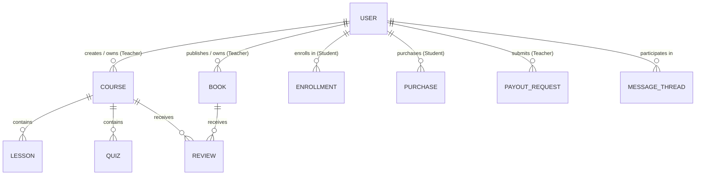

# StudyMart — Data Models & Schema Reference

This document provides a comprehensive schema reference for all data entities, object structures, relationships, and persistence keys across StudyMart.

---

## 1. Data Schema Overview

StudyMart maintains a client-side data architecture. Initial domain entities are bootstrapped from static JSON/JS files in `/js/data/` and updated dynamically in `localStorage`.



---

## 2. Core Entities & Schemas

### 1. User Object Schema (`User`)
- **Primary Source**: `js/data/studentsData.js`, `js/data/teachers.js`, `js/services/authStorage.js`
- **Storage Keys**: `studymart_current_user`, `studymart_users`

```typescript
interface User {
  id: string;                      // Unique ID e.g., "owner_1", "teacher-1", "std-101"
  name: string;                    // User full display name
  email: string;                   // Canonical email address
  role: "owner" | "teacher" | "student"; // Granted user role
  image?: string;                  // Avatar image URL or base64 string
  bio?: string;                    // Instructor biography or student bio
  status: "Active" | "Blocked" | "Suspended"; // Account status
  isBlocked?: boolean;             // Boolean flag for quick status check
  adminNotes?: string;             // Private notes written by Platform Owner
  courses?: string[];              // Enrolled course IDs (for students)
  purchasedBooks?: string[];       // Purchased book IDs (for students)
  joinedDate?: string;             // ISO date string of account creation
  totalSpent?: number;             // Total purchases value in EGP (for students)
  totalEarned?: number;            // Total earnings in EGP (for teachers)
}
```

---

### 2. Course Schema (`Course`)
- **Primary Source**: `js/data/courses.js`
- **Storage Keys**: `studymart_courses_v1` (or memory fallback)

```typescript
interface Course {
  id: string | number;             // Unique course ID e.g., "course_101"
  title: string;                   // Course title
  description: string;             // Detailed course description
  category: string;                // Category e.g., "برمجة وتطوير", "تصميم", "أعمال"
  level: "مبتدئ" | "متوسط" | "متقدم"; // Target audience level
  price: number;                   // Course price in EGP (0 for free)
  originalPrice?: number;          // Strikethrough list price
  rating: number;                  // Average star rating (e.g., 4.8)
  reviewCount: number;             // Total review count
  studentsCount: number;           // Total enrolled student count
  teacher: {
    id: string;
    name: string;
    avatar: string;
    title: string;
  };
  thumbnail: string;               // Cover thumbnail image URL
  previewVideoUrl?: string;        // Introductory video URL (YouTube / MP4)
  sections: CourseSection[];       // Curriculum sections
  isPublished: boolean;            // Status flag (published vs draft)
  isFeatured?: boolean;            // Featured flag on homepage
  createdAt: string;               // ISO timestamp
}

interface CourseSection {
  id: string;
  title: string;
  lessons: CourseLesson[];
}

interface CourseLesson {
  id: string;
  title: string;
  duration: string;               // e.g., "12:45"
  videoUrl: string;               // Stream video URL
  isFreePreview: boolean;         // Free preview flag
  attachments?: { name: string; url: string }[];
}
```

---

### 3. Digital Book Schema (`Book`)
- **Primary Source**: `js/data/books.js`
- **Storage Keys**: `studymart_books_v1` (or memory fallback)

```typescript
interface Book {
  id: string;                      // Unique book ID e.g., "book_1"
  title: string;                   // Book title
  author: string;                  // Author name
  category: string;                // Book category
  price: number;                   // Book price in EGP
  originalPrice?: number;          // Strikethrough price
  rating: number;                  // Average star rating
  reviewsCount: number;            // Total reviews count
  pagesCount: number;              // Total pages in PDF
  freePreviewPages: number;        // Allowed free preview pages (e.g., 5)
  coverImage: string;              // Cover image URL
  pdfUrl: string;                  // PDF document URL / Blob URI
  description: string;             // Summary description
  publishedDate: string;           // Publication date string
  isPublished: boolean;            // Draft vs Published
  isFeatured?: boolean;            // Featured on homepage flag
}
```

---

### 4. Quiz & Question Bank Schema (`Question` & `Quiz`)
- **Primary Source**: `js/data/courseQuestionsData.js`
- **Storage Key**: `studyMart_questions_bank`

```typescript
interface Question {
  id: string;                      // Unique question ID
  type: "multiple-choice" | "true-false" | "essay" | "code" | "matching";
  title: string;                   // Question text
  options?: string[];              // Choices for multiple choice
  correctAnswer: string | number;  // Correct choice index or boolean text
  explanation?: string;            // Answer explanation
  points: number;                  // Assigned score points
  category: string;                // Subject tag
}
```

---

### 5. Financial Payout Request Schema (`PayoutRequest`)
- **Primary Source**: `js/data/payoutsData.js`
- **Storage Key**: `studyMart_payouts`

```typescript
interface PayoutRequest {
  id: string;                      // Unique payout ID e.g., "PAY-1001"
  teacherId: string;               // Instructor ID requesting withdrawal
  teacherName: string;             // Instructor display name
  amount: number;                  // Requested amount in EGP
  method: "Vodafone Cash" | "InstaPay" | "Bank Transfer";
  accountDetails: string;          // Account number / phone / IBAN
  status: "Pending" | "Under Review" | "Approved" | "Rejected";
  requestDate: string;             // Request creation timestamp
  processedDate?: string;          // Approval/Rejection timestamp
  rejectionReason?: string;        // Feedback message if rejected
}
```

---

## 3. Persistence Key Directory

| Storage Key Name | Data Type | Owner Service | Purpose |
|---|---|---|---|
| `studymart_current_user` | JSON Object | `authStorage.js` | Active session details |
| `studymart_users` | JSON Array | `authStorage.js` | Registered users directory |
| `studymart_account_statuses_v1` | JSON Object | `accountStatusService.js` | Master blocked/suspended map |
| `lms_enrolled_students_v1` | JSON Array | `ownerStudentsService.js` | Enrolled students & admin notes |
| `lms_owner_teachers_v1` | JSON Object | `ownerTeachersService.js` | Teachers directory & admin notes |
| `studyMart_cart` | JSON Array | `cartService.js` | Shopping cart items |
| `studyMart_favorites` | JSON Array | `favoritesService.js` | Wishlist items |
| `studyMart_payouts` | JSON Array | `payoutsService.js` | Payout requests ledger |
| `studyMart_featured_config` | JSON Object | `homepageManagementService.js` | Homepage featured content config |
| `studyMart_questions_bank` | JSON Array | `questionBankService.js` | Reusable quiz question bank |
| `studyMart_theme` | String | `themeService.js` | Selected theme (`dark` / `light`) |
