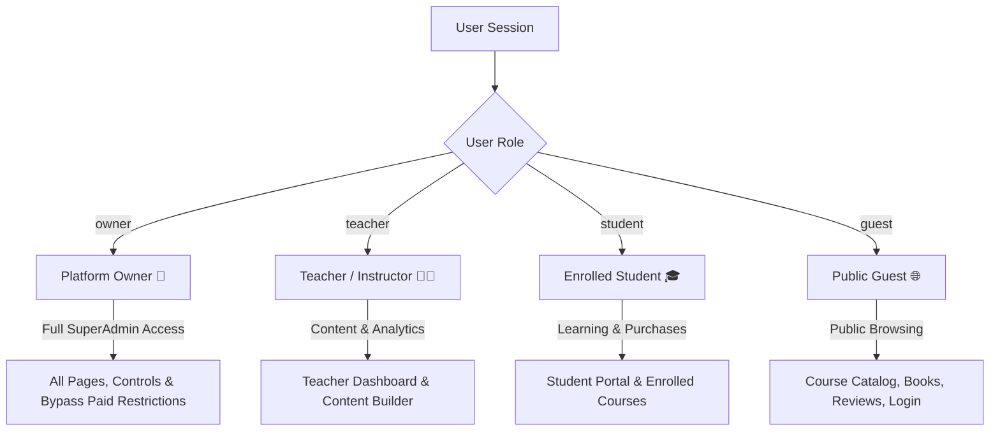

# StudyMart — Roles & Permission Matrix

StudyMart enforces a client-side **Role-Based Access Control (RBAC)** architecture managed centrally via `/js/services/permissionService.js`.

---

## 1. Supported User Roles

StudyMart defines four distinct roles across the platform:

---

## 2. Comprehensive Permission Matrix

The table below maps verified permissions defined in `PERMISSIONS` constants to each user role:

| Feature / Capability | Platform Owner (`owner`) | Teacher (`teacher`) | Student (`student`) | Public / Guest (`guest`) |
|---|:---:|:---:|:---:|:---:|
| **Homepage Content Customization** | ✅ **Full** | ❌ Denied | ❌ Denied | ❌ Denied |
| **Global Student Account Management** | ✅ **Full** | ❌ Denied | ❌ Denied | ❌ Denied |
| **Global Student Block / Unblock** | ✅ **Full** | ❌ Denied | ❌ Denied | ❌ Denied |
| **Global Teacher Account Management** | ✅ **Full** | ❌ Denied | ❌ Denied | ❌ Denied |
| **Global Teacher Suspend / Reactivate** | ✅ **Full** | ❌ Denied | ❌ Denied | ❌ Denied |
| **Global Administrative Notes** | ✅ **Full** | ❌ Denied | ❌ Denied | ❌ Denied |
| **Approve / Reject Payout Requests** | ✅ **Full** | ❌ Denied | ❌ Denied | ❌ Denied |
| **Platform Revenue 10% Commission View** | ✅ **Full** | ❌ Denied | ❌ Denied | ❌ Denied |
| **Bypass Paid Restrictions (Free Access)**| ✅ **Full** | ❌ Denied | ❌ Denied | ❌ Denied |
| **Course Creation & Editing** | ✅ **Full** | ✅ **Own** | ❌ Denied | ❌ Denied |
| **Digital Book Creation & Editing** | ✅ **Full** | ✅ **Own** | ❌ Denied | ❌ Denied |
| **Course & Book Management Dashboard** | ✅ **Full** | ✅ **Own** | ❌ Denied | ❌ Denied |
| **Advanced Quiz & Assignment Builder** | ✅ **Full** | ✅ **Own** | ❌ Denied | ❌ Denied |
| **Question Bank & AI Generator** | ✅ **Full** | ✅ **Own** | ❌ Denied | ❌ Denied |
| **View Enrolled Students (Per Course)** | ✅ **Full** | ✅ **Own** | ❌ Denied | ❌ Denied |
| **Teacher Financial Payout Requests** | ✅ **Full** | ✅ **Own** | ❌ Denied | ❌ Denied |
| **Message Center (Chat with Students/Teachers)** | ✅ **Full** | ✅ **Full** | ✅ **Full** | ❌ Denied |
| **Course Enrollment & Purchase** | ✅ **Full** | ✅ **Full** | ✅ **Full** | ❌ Denied (Prompted Login) |
| **Digital Book Reader Access** | ✅ **All Books** | 🔒 Purchased | 🔒 Purchased | ❌ Denied (Prompted Login) |
| **My Enrolled Courses & Books Portal** | ✅ **Full** | ✅ **Full** | ✅ **Full** | ❌ Denied |
| **Course & Book Reviews & Ratings** | ✅ **Full** | ✅ **Full** | ✅ **Full** | 👁️ View Only |
| **Public Course & Book Catalog** | 👁️ View | 👁️ View | 👁️ View | 👁️ View |
| **Public Reviews Page (`#public-reviews`)** | 👁️ View | 👁️ View | 👁️ View | 👁️ View |

---

## 3. Detailed Role Descriptions & Capabilities

### 👑 1. Platform Owner (`owner`)
- **SuperAdmin Authority**: Has unrestricted access to all routes, admin controls, and content.
- **Exclusive Administrative Capabilities**:
  - `owner/homepage-management`: Toggles featured banners, courses, books, top teachers, and student testimonials on the home page.
  - `owner/students`: Complete catalog of registered students. Allows searching, filtering, inspecting purchase history, writing admin notes, and **blocking/unblocking** student accounts.
  - `owner/teachers`: Complete catalog of instructors. Allows searching, inspecting published items, total earnings, writing admin notes, and **suspending/unsuspending** teacher accounts.
  - `payouts`: Reviews pending teacher withdrawal requests and approves or rejects them.
  - `revenue`: Views full platform sales metrics, total platform income, teacher earnings, and net 10% platform revenue.
- **Automatic Paid Restriction Bypass**: `canAccessCourse` and `canAccessBook` return `true` unconditionally for the Platform Owner, enabling seamless auditing of all paid materials without requiring purchase transactions.

### 👨‍🏫 2. Teacher (`teacher`)
- **Instructor Portal**: Designed for content creators to construct, publish, and monetize educational products.
- **Key Capabilities**:
  - `teacher/course-builder`: Full drag-and-drop course creation suite supporting curriculum sections, video lectures, resource downloads, pricing, and draft/published state toggling.
  - `teacher/book-builder`: Digital book publisher supporting PDF file upload, cover image selection, page preview count, table of contents, and pricing.
  - `teacher/courses` & `teacher/books`: Dashboards to list, search, edit, publish, or delete owned courses and books.
  - `teacher/question-bank`: Reusable question repository with Gemini AI question generation.
  - `teacher/students`: List of students enrolled in the teacher's courses, progress tracking, gradebook, and custom notes.
  - `teacher/payouts`: Wallet balance overview, payout history, and submission of withdrawal requests to the Platform Owner.
  - `teacher/revenue` & `teacher/transactions`: Detailed sales breakdown for the teacher's products.

### 🎓 3. Student (`student`)
- **Learner Experience**: Focused on browsing catalog, purchasing, watching video lectures, reading books, and tracking progress.
- **Key Capabilities**:
  - `my-courses`: Interactive learning dashboard displaying active course enrollments, video lecture player, lesson progress, and completion certificate generation.
  - `my-books`: Digital bookshelf displaying purchased books with embedded canvas-based PDF reader (`#reader/:bookId`).
  - `favorites`: Wishlist tracking for saved courses and books.
  - `purchases`: Complete purchase history with receipt preview and printable PDF invoices.
  - `messages`: Message Center to communicate directly with course instructors.

### 🌐 4. Public / Guest (`guest`)
- **Unauthenticated Visitor**:
  - Access to public landing page (`#home`), course catalog (`#courses`), digital books catalog (`#books`), teacher profile pages (`#teacher-profile/:key`), and public reviews (`#public-reviews`).
  - Attempting to access protected routes (`#my-courses`, `#teacher/dashboard`, `#owner/students`, `#cart`, `#checkout`, `#profile`) automatically triggers the Login Modal with a toast notification: *"Please login to access this page"*.

---

## 4. Default Credentials (Development & Testing)

The project includes pre-configured credentials in `.env.example` and `permissionService.js` for rapid local testing:

| Role | Email | Password |
|---|---|---|
| **Platform Owner** | `2005eaja@gmail.com` (or `owner@gmail.com`) | `Eslam@50` |
| **Teacher Test** | `evip4158@gmail.com` (or `teacher@gmail.com`) | `Eslam@401` |
| **Student Test** | `etak5806@gmail.com` (or `student@gmail.com`) | `Eslam@301` |
