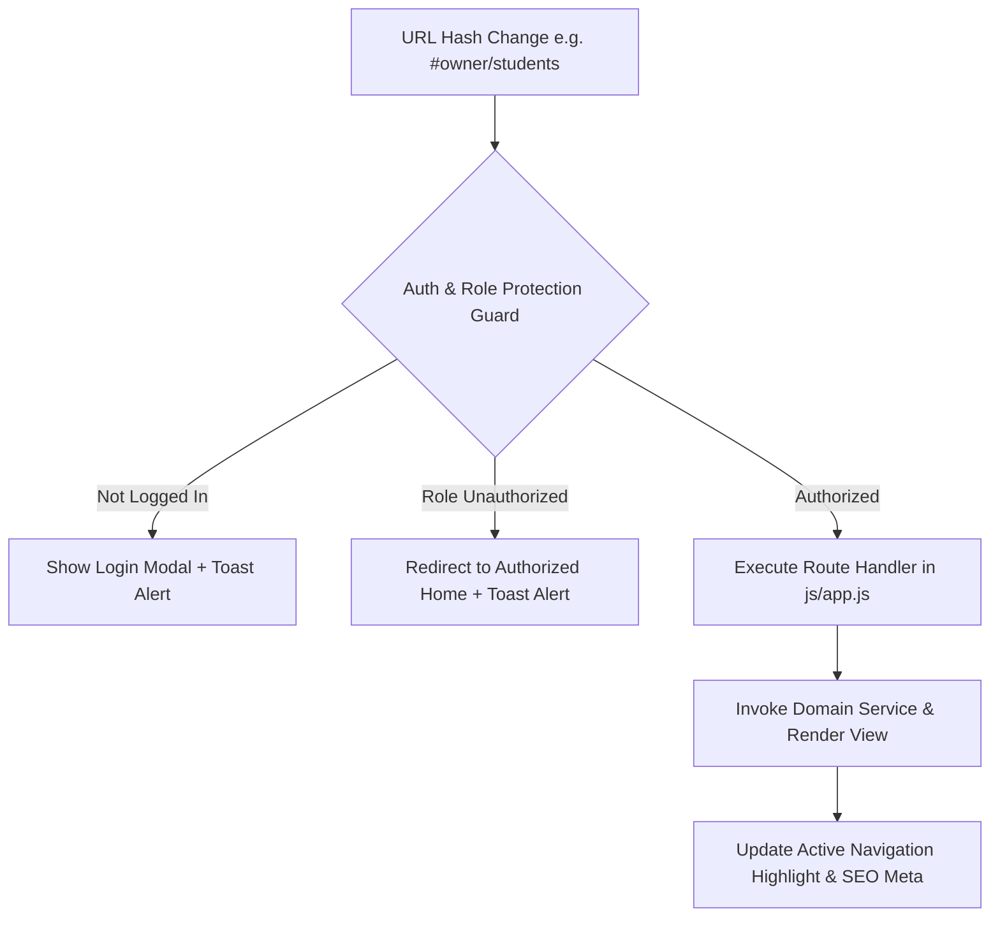

# StudyMart — Routing System & Route Map

StudyMart uses a client-side **Hash Routing Engine** managed in `/js/app.js` through `window.addEventListener("hashchange", handleRoleRouteProtection)`.

---

## 1. Routing Architecture



### Route Guard Flow (`handleRoleRouteProtection`):
1. **Hash Parsing**: Extracts route string and query parameters (e.g. `?id=course_101`).
2. **Authentication Validation**: Checks `window.appState.isLoggedIn`. Unauthenticated users attempting to access protected routes are blocked and redirected to `#home` with the login modal open.
3. **Role Authorization Check**: Evaluates `isOwner(userRole)`, `isTeacher(userRole)`, and `isStudent(userRole)`.
   - Non-owners attempting to access `#owner/*` are redirected to `#teacher/dashboard` with an error toast.
   - Non-teachers attempting to access `#teacher/*` are redirected to `#home`.

---

## 2. Complete Application Route Map

### 🌐 1. Public & Guest Routes
| Route Hash | Target Service / Component | Description | Access Level |
|---|---|---|---|
| `#home` / `#` | `LayoutService.showHomePage()` | Public landing page with hero banner & featured cards | Public |
| `#courses` | `LayoutService.showCoursesPage()` | Complete course catalog with filter sidebar | Public |
| `#books` | `LayoutService.showBooksPage()` | Digital books catalog with category filters | Public |
| `#public-reviews` | `LayoutService.showPublicReviewsPage()` | Dedicated student review & testimonial showcase | Public |
| `#course-details?id=...` | `CourseService.showCourseDetails(id)` | Course details, video preview, curriculum breakdown | Public |
| `#book-details?id=...` | `BookService.showBookDetails(id)` | Book details, chapter outline, free preview reader | Public |
| `#teacher-profile/:key` | `CourseService.showTeacherProfilePage(key)` | Public instructor biography and published items | Public |
| `#contact` | `LayoutService.scrollToSection("contact")` | Smooth scroll to footer contact section | Public |

---

### 🎓 2. Student Routes
| Route Hash | Target Service / Component | Description | Access Level |
|---|---|---|---|
| `#my-courses` / `#student/courses` | `CourseService.renderMyCoursesPage()` | Enrolled courses learning portal & video player | Logged-in Student |
| `#my-books` / `#student/books` | `BookService.renderMyBooksPage()` | Purchased digital books bookshelf | Logged-in Student |
| `#reader/:bookId?page=...` | `BookService.renderBookReaderPage(id, page)` | PDF digital book reader modal | Logged-in Student |
| `#favorites` | `FavoritesService.renderFavoritesPage()` | Bookmarked courses and books wishlist | Logged-in User |
| `#purchases` | `PurchasesService.renderPurchasesPage()` | Past order receipts and printable PDF invoices | Logged-in User |
| `#profile` / `#student/profile` | `ProfileService.renderProfilePage()` | Edit profile avatar, bio, and change password | Logged-in User |

---

### 👨‍🏫 3. Teacher Routes (`#teacher/...`)
| Route Hash | Target Service / Component | Description | Access Level |
|---|---|---|---|
| `#teacher/dashboard` | `openCourseManagementDashboard()` | Main instructor management dashboard | Teacher / Owner |
| `#teacher/course-builder` | `openCourseBuilder(id)` | Interactive course builder wizard | Teacher / Owner |
| `#teacher/courses` | `openCourseManagementDashboard()` | List, edit, draft, and delete owned courses | Teacher / Owner |
| `#teacher/book-builder` | `openBookBuilder(id)` | Digital book creator and PDF uploader | Teacher / Owner |
| `#teacher/books` | `openBookManagementDashboard()` | List, edit prices, draft, and delete books | Teacher / Owner |
| `#teacher/question-bank` | `renderQuestionBankPage()` | Reusable quiz question bank & Gemini AI generator | Teacher / Owner |
| `#teacher/students` | `EnrolledStudentsService.openEnrolledStudentsPage()`| List enrolled students, gradebook, and notes | Teacher / Owner |
| `#teacher/reviews` | `StudentReviewsService.openStudentReviewsPage()` | Student feedback, star ratings, and reply tool | Teacher / Owner |
| `#teacher/messages` | `MessageCenterService.openMessageCenterPage()` | In-app messaging center with students | Teacher / Owner |
| `#teacher/payouts` | `PayoutsService.openPayoutsDashboard()` | Wallet balance overview and withdrawal requests | Teacher / Owner |
| `#teacher/revenue` | `RevenueTransactionService.openRevenueDashboard()` | Sales analytics and earnings breakdown | Teacher / Owner |
| `#teacher/transactions` | `RevenueTransactionService.openTransactionHistory()`| Detailed sales logs and PDF transaction export | Teacher / Owner |

---

### 👑 4. Platform Owner Exclusive Routes (`#owner/...`)
| Route Hash | Target Service / Component | Description | Access Level |
|---|---|---|---|
| `#owner/homepage-management` | `openHomepageManagement()` | Configure featured homepage courses, books & teachers | Platform Owner Only |
| `#owner/students` | `openOwnerStudentsManagement()` | Manage registered students, view details, **block/unblock** | Platform Owner Only |
| `#owner/student-details?id=...` | `openOwnerStudentDetailPage(id)` | Inspect student activity, purchase logs & write admin notes | Platform Owner Only |
| `#owner/teachers` | `openOwnerTeachersManagement()` | Manage instructors, view details, **suspend/unsuspend** | Platform Owner Only |
| `#owner/teacher-details?id=...` | `openOwnerTeacherDetailPage(id)` | Inspect instructor revenue, courses & write admin notes | Platform Owner Only |

---

## 3. Dynamic Secondary Route Resolution

Routing query parameters are cleanly extracted from the hash string using `URLSearchParams`:

```javascript
// Example parameter parsing in js/app.js:
const cleanHash = hash.startsWith("#") ? hash.substring(1) : hash;
const urlParams = new URLSearchParams(cleanHash.split("?")[1] || "");
const courseId = urlParams.get("id");
```

This guarantees seamless deep linking and browser refresh retention for detail views such as `#course-details?id=course_101` and `#reader/book_202?page=5`.
