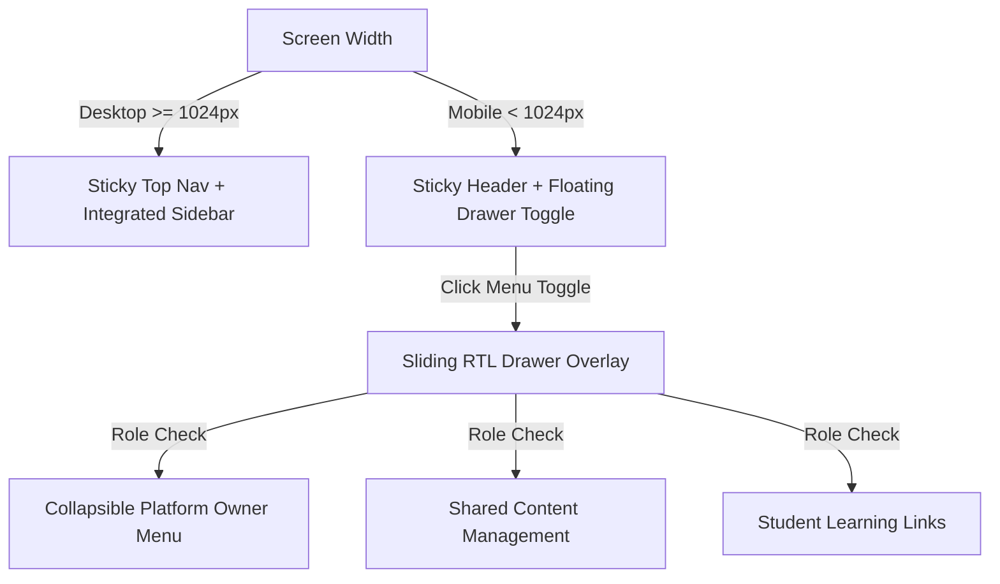

# StudyMart — UI/UX Design System & Theme Architecture

This document describes the design language, visual hierarchy, typography, color palettes, responsive layouts, and accessibility standards implemented in **StudyMart**.

---

## 1. Design Philosophy & RTL First Principles

StudyMart is engineered ground-up as an **Arabic-First, Right-To-Left (RTL)** learning management platform.

### Core Visual Principles:
- **RTL Orientation (`dir="rtl"`)**: All container layouts, text alignments, flex directions, icon placements, and drawer overlays follow native Arabic reading patterns.
- **Tajawal Typographic Scale**: Utilizes the Google Font **Tajawal** (`font-['Tajawal',sans-serif]`) across all UI elements, offering clean readability from high-density data tables to display headlines.
- **Sleek Slate Dark Palette**: Default dark canvas built using Slate and Indigo/Purple accent colors (`bg-slate-950`, `bg-slate-900`, `from-purple-600 to-indigo-500`), providing high contrast and reduced eye strain during extended learning sessions.
- **Light Theme Support**: Secondary high-contrast light mode managed dynamically via `themeService.js`.

---

## 2. Color System & Palettes

| Color Token | Tailwind Utility | Visual Application |
|---|---|---|
| **Primary Accent** | `bg-purple-600` / `text-purple-400` | Primary buttons, active tabs, brand icons |
| **Secondary Gradient** | `from-purple-600 to-indigo-500` | Header brand mark, CTA buttons, hero highlights |
| **Dark Background** | `bg-slate-950` | Main application backdrop |
| **Dark Container** | `bg-slate-900/90` | Cards, modals, sidebars, sticky headers |
| **Dark Border** | `border-slate-800` | Dividers, card frames, input borders |
| **Text Primary** | `text-slate-100` / `text-white` | Main headings and body text |
| **Text Secondary** | `text-slate-400` | Subtitles, metadata badges, passive tabs |
| **Danger / Blocked** | `bg-red-500/10` / `text-red-400` | Account suspension alerts, delete buttons, status badges |
| **Success / Active** | `bg-emerald-500/10` / `text-emerald-400` | Active accounts, approved payouts, completed lessons |

---

## 3. Responsive Drawer & Navigation Layout

StudyMart features a unified responsive navigation layout managed by `sidebarService.js` and `authService.js`:

### Navigation Hierarchy Rules:
1. **Top Header**: High-level role context switchers (`الدورات التدريبية`, `لوحة المعلم`, `لوحة الطالب`), notification bell with active counter badge, wishlist heart counter, shopping cart counter, and user profile avatar.
2. **Platform Owner Section (`#owner-menu-section`)**:
   - Collapsible sub-menu container formatted with distinct dark background (`#1e293b`), purple accent border (`#8b5cf6`), and expand/collapse arrow indicator.
   - Contains ONLY administrative features (`إدارة الصفحة الرئيسية`, `إدارة الطلاب`, `إدارة المعلمين`).
3. **Shared Content Section**: Grouped content management tools accessible to both Teachers and Owner (`إضافة دورة جديدة`, `إدارة الدورات`, `إضافة كتاب`, `إدارة الكتب`).

---

## 4. Component Patterns

### 1. Interactive Modals
- Built with backdrop blur overlays (`backdrop-blur-md bg-slate-950/80`), smooth enter transitions, ESC key closing, and focus trap containment.

### 2. Toast Notifications
- Floating toast messages for feedback (e.g., *"Course added to cart"*, *"Account blocked successfully"*, *"Permission denied"*).

### 3. Data Tables & Filters
- Compact, responsive tables with real-time text search, role filter pills, status badges (`Active`, `Blocked`, `Suspended`), quick action menus, and PDF export triggers.
